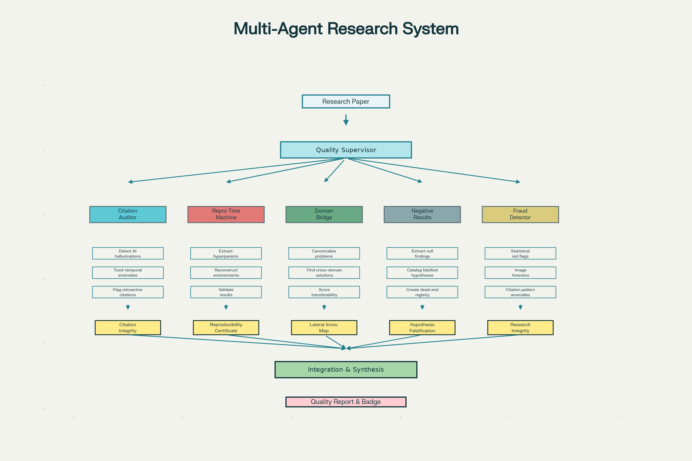
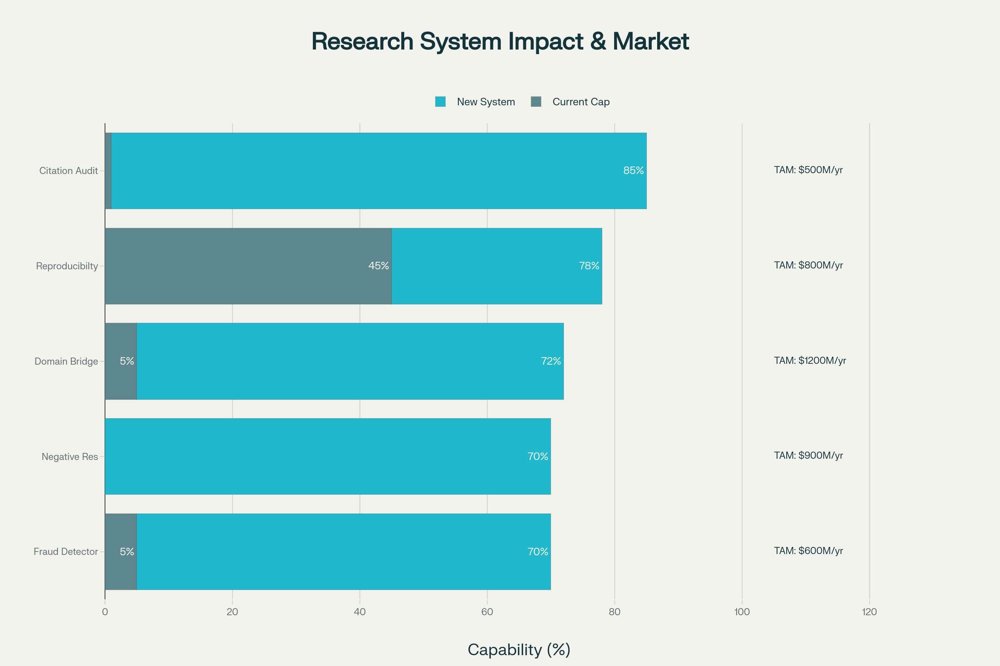

# Autonomous Scientific Literature Research System

This system provides a production-ready environment for autonomous scientific research using **Google Agent Development Kit (ADK)** and **Google Gemini 2.5 Flash Lite**. It goes beyond simple literature review to include advanced quality control, fraud detection, and cross-domain innovation bridging.



## 🚀 Features & Innovation Architecture

The system implements a multi-stage agentic workflow designed to solve critical gaps in modern research (citation contamination, reproducibility crisis, and knowledge silos).

### Core Workflow
1.  **Query Formulation**: Converts broad topics into precise academic search strategies.
2.  **Literature Mining**: Parallel deep search across ArXiv and the Web.
3.  **Knowledge Graph**: Constructs an ontology-based graph of concepts, authors, and findings.
4.  **Gap Analysis**: Identifies missing links, contradictions, and underexplored areas using graph analysis.
5.  **Hypothesis Generation**: Proposes novel research questions and experimental designs.
6.  **Writing**: Drafts comprehensive literature reviews with properly formatted citations.
7.  **Evaluation**: Critiques the final output for novelty, feasibility, and clarity.

### 🛡️ Quality Control Stage (New)
*   **Citation Auditor**: Detects "time-traveling" citations (retroactive references) and AI hallucinations to prevent data contamination loops.
*   **Fraud Detector**: Analyzes statistical patterns (Benford's Law, P-value consistency) to flag potentially fabricated data or anomalies.
*   **Reproducibility Time Machine**: Extracts code blocks, hyperparameters, and dependencies to verify if the research is computationally reproducible.

### 💡 Innovation Stage (New)
*   **Domain Bridge**: Maps problems to abstract mathematical forms to find solutions in unrelated fields (e.g., Biology -> Finance).
*   **Negative Results Discoverer**: Specifically hunts for failed experiments and null results to prevent wasted R&D effort on dead ends.



## 🛠️ Tech Stack

- **Frontend**: Streamlit (Interactive Dashboard)
- **Orchestration**: Google Agent Development Kit (ADK) - Sequential & Parallel Agents
- **LLM**: Google Gemini 2.5 Flash Lite (Optimized for speed/cost)
- **Tools**: ArXiv API, DuckDuckGo Search, Custom Forensic Tools (NumPy/SciPy)
- **Backend**: Python 3.13+

## 📦 Installation

1.  **Clone the repository**:
    ```bash
    git clone <repository-url>
    cd scientific_research_system
    ```

2.  **Install Dependencies**:
    ```bash
    pip install -r requirements_prod.txt
    ```

3.  **Configuration**:
    *   Copy `env.example` to `.env`.
    *   Add your **Google API Key**.
    *   (Optional) Set `EXECUTION_MODE=parallel` if you have a paid tier API key (defaults to `sequential` for free tier limits).

    ```bash
    cp env.example .env
    # Edit .env with your key
    ```

## 🏃‍♂️ Usage

### Launch the User Interface

```bash
streamlit run app.py
```

This will open a web interface where you can:
1.  Enter your Google API Key.
2.  Select **Execution Mode** (Sequential vs Parallel).
3.  Define a research topic.
4.  Watch the multi-agent system execute in real-time via the **Execution Logs**.
5.  View detailed results in tabs: Literature Review, Hypotheses, Gaps, Knowledge Graph.
6.  Download the final comprehensive report (Markdown).

### Run from Command Line

```bash
python main.py
```

## 📂 Project Structure

```text
scientific_research_system/
├── agents/                 # Core ADK Agent Implementations
│   ├── research_app.py     # Main Supervisor Workflow
│   ├── citation_auditor.py # Citation Integrity Agent
│   ├── fraud_detector.py   # Statistical Forensics Agent
│   ├── domain_bridge.py    # Cross-Domain Innovation Agent
│   ├── negative_results.py # Dead-End Discovery Agent
│   └── ...
├── tools/                  # Function Tools
│   ├── citation_tools.py   # Citation metadata & anomaly detection
│   ├── forensics_tools.py  # Benford's Law & P-value checks
│   ├── code_tools.py       # Code extraction & env validation
│   └── ...
├── app.py                  # Streamlit Main Application
├── config.py               # Configuration Management
├── requirements_prod.txt   # Production Dependencies
└── docs/
    └── images/             # Architecture diagrams
```

## 📊 System Architecture

The system uses a hierarchical agent architecture:

1.  **Input**: User Research Topic.
2.  **Mining Stage**: Gather raw data (Papers, Web).
3.  **Quality Gate**: Agents run in parallel/sequence to audit citation integrity, fraud risk, and reproducibility.
4.  **Analysis**: Knowledge Graph construction & Gap Analysis.
5.  **Innovation Gate**: Agents find cross-domain solutions and negative results.
6.  **Synthesis**: Generate Hypotheses -> Write Draft -> Evaluate.
7.  **Output**: Verified, Innovative Research Report.

## 🧪 Testing

To verify the system:
1.  Run `streamlit run app.py`.
2.  Enter API Key.
3.  Topic: "Machine Learning for Climate Change".
4.  Check the **Execution Logs** expander to see agents like `citation_auditor` and `fraud_detector` activating.
5.  Verify that the final report includes sections for "Quality Control Audits" and "Innovation Insights".
